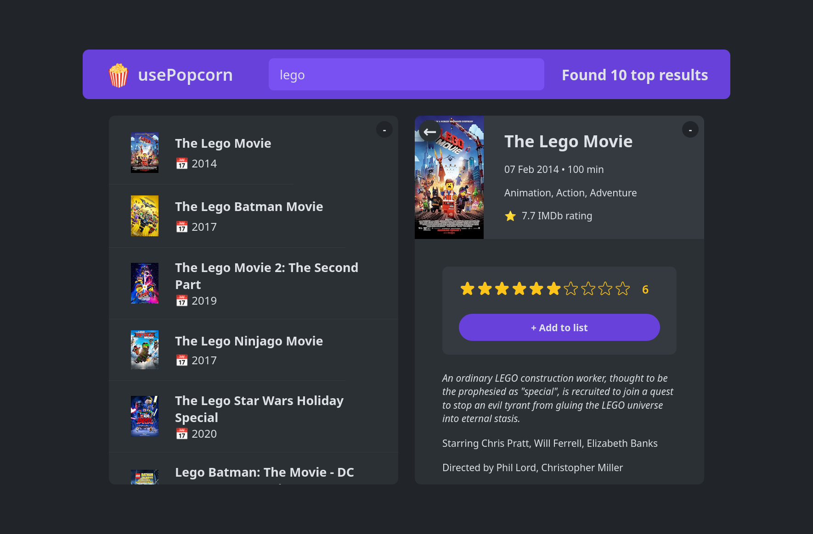
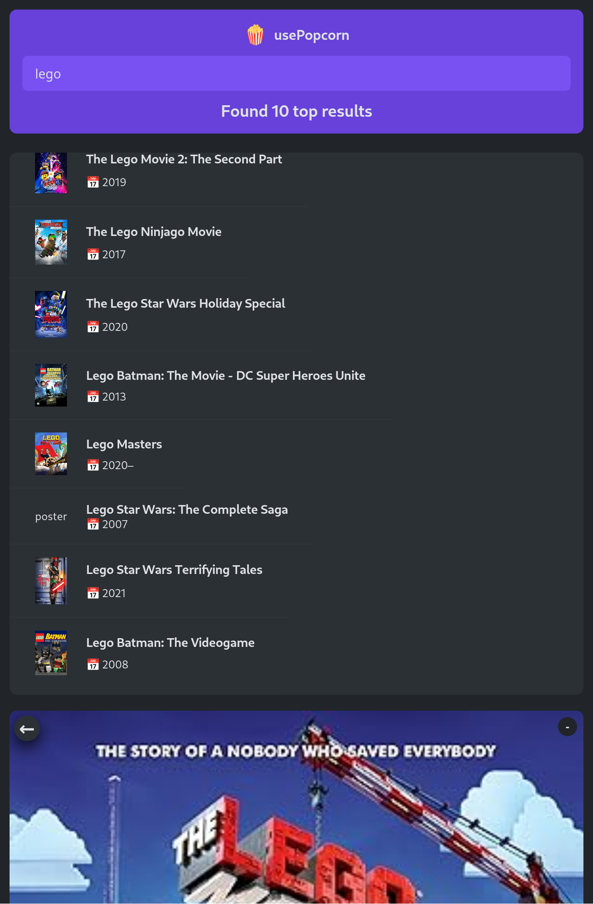
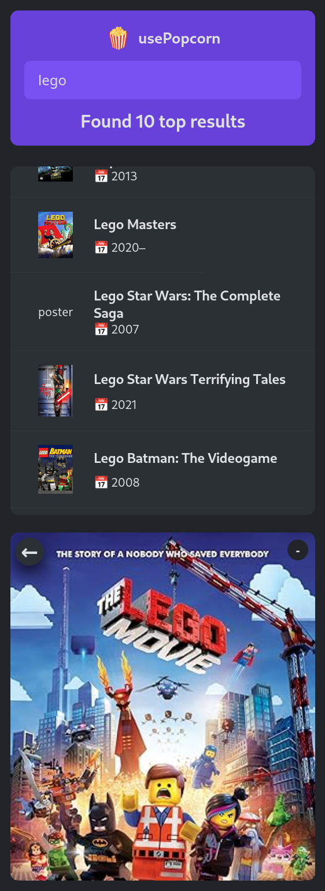

# UsePopCorn – Movie Search & Watchlist

A movie search and personal watchlist app built with React and Zustand. Search for any film, view its details, rate it, and save it to a persistent watchlist.

**Live:** https://udemy-part2.netlify.app

---

## Screenshots





---

## Features

- **Movie search** — search the OMDb API in real time with proper loading and error states for both search results and individual movie detail views
- **Watchlist** — add movies to a personal watchlist with your own star rating; list persists across page refreshes via localStorage
- **Duplicate prevention** — attempting to add an already-watched movie is blocked before the state update
- **Race condition handling** — fast typing no longer causes stale API responses to overwrite newer results
- **Keyboard shortcuts** — press `Enter` to focus the search input from anywhere; press `Escape` to close the movie detail panel

---

## Tech Stack

| Layer            | Technology      |
| ---------------- | --------------- |
| Frontend         | React 18, Vite  |
| Routing          | React Router v6 |
| State Management | Zustand, Immer  |
| Movie Data       | OMDb API        |
| Persistence      | localStorage    |
| Styling          | CSS Modules     |

---

## Architecture Decisions

**Why Zustand over Context API**
State is split into two independent slices — `movieSlice` for search query and results, and `watchedSlice` for the personal watchlist — both combined via `useBoundStore`. Keeping them separate means a search state change never triggers a re-render in the watchlist and vice versa. Zustand's slice pattern makes this clean without the boilerplate of Redux.

**Why Immer**
Immer is used inside Zustand to allow direct mutation-style updates on nested state without manually spreading objects. This reduces the chance of accidental state bugs in complex updates like toggling watched status.

**Race condition fix with `AbortController`**
When a user types quickly, multiple API requests fire in rapid succession. Without cancellation, a slow earlier response can arrive after a faster later one and overwrite the correct results. The fix uses `AbortController` to cancel the previous request each time a new one fires, combined with a `get().query === query` stale-check guard to drop any response that no longer matches the current search term.

**localStorage persistence**
An early bug only saved the newly added movie to localStorage, so the list shrank to one item after every refresh. The fix saves the entire updated array after every change, not just the new entry.

**Duplicate watchlist entries**
`.includes()` checks for exact object reference equality, not value equality — it always returns false when comparing two separately created objects that represent the same movie. Switched to `.some(m => m.imdbID === newMovie.imdbID)` which checks by movie ID instead.

**`useKey` hook and the focus bug**
A single `useKey` hook was used to handle both `Escape` (close panel) and `Enter` (focus search input). The problem was that the hook tried to call `.focus()` on the input ref even when the key pressed was `Escape`, causing a runtime error. The fix separates the two concerns inside the hook — the focus call only runs when the intended key matches — keeping behaviour predictable without needing two separate hooks.

---

## Getting Started

### Prerequisites

- Node.js 18+
- A free OMDb API key from https://www.omdbapi.com/apikey.aspx

### Environment Variables

Create a `.env` file in the root:

```
VITE_OMDB_API_KEY=your_omdb_api_key
```

### Install and Run

```bash
git clone https://github.com/msshaikh1717/udemy-part2
cd udemy-part2
npm install
npm run dev
```

The UsePopCorn app entry point is `src/AppUsePopCorn.jsx`. The repo also contains other standalone React practice apps (`AppChallenge1`, `AppCurrencyConverterChallenge`, `AppHowReactWorks`, `AppUseGeolocate`) built during the same learning period.

---

## Project Structure

```
src/
├── features/
│   └── usePopCorn/
│       ├── ErrorMessage.jsx
│       ├── MoviesList/
│       │   ├── MovieItem.jsx
│       │   └── MoviesList.jsx
│       ├── NavBar/
│       │   ├── Logo.jsx
│       │   ├── NavBar.jsx
│       │   ├── Results.jsx
│       │   └── Search.jsx
│       └── WatchList/
│           ├── WatchedMovieItem.jsx
│           ├── WatchedSummary.jsx
│           └── WatchList.jsx
├── hooks/
│   └── useKey.js                  # Keyboard shortcut handler (Enter / Escape)
├── stores/
│   ├── slices/
│   │   ├── movieSlice.js          # Search query and results state
│   │   └── watchedSlice.js        # Watchlist state + localStorage persistence
│   └── useBoundStore.js           # Combined Zustand store
└── AppUsePopCorn.jsx              # Root component and router setup
```

---

## Known Limitations

- OMDb free tier is limited to 1,000 requests per day
- Search requires at least 1 character — no browse or discover feature
- Watchlist is stored in localStorage only (no account sync)

---

## License

MIT
